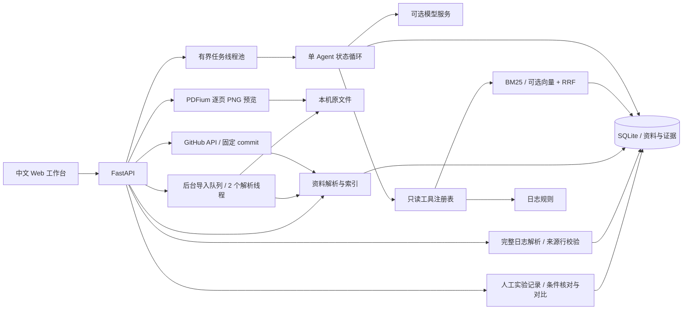
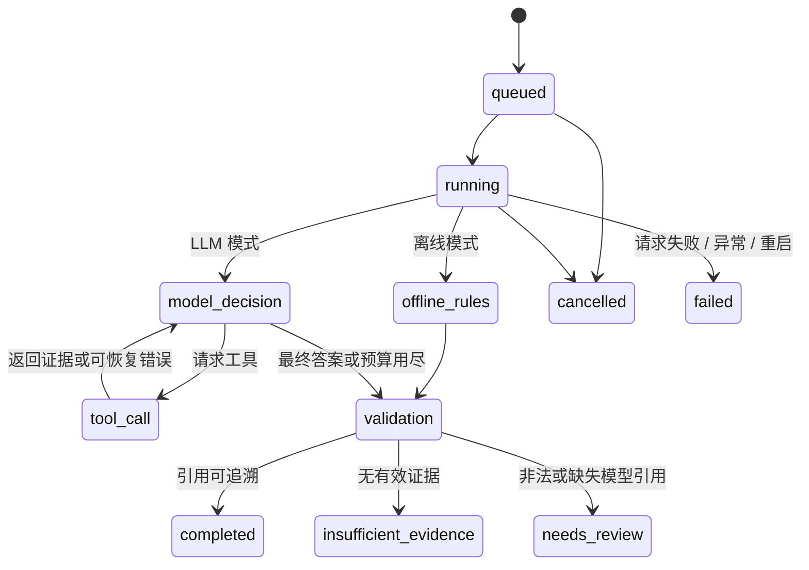

# 系统设计与实现说明

v0.10 在可选账号之上增加共享的资源管理器：项目/资料数量由 SQLite 写事务控制；后台、同步上传和仓库导入共用进程内并发名额，取消收尾期间保留名额；原文件空间按账号计算并为导入预留。HTTP 边界逐段读取时计数，避免仅依赖 Content-Length。运行统计只存内存和状态码/耗时，不记录请求内容。仍要求单进程单 worker，配置与联网边界见 [部署说明](deployment.md)。

## 总体架构

FastAPI 与静态前端同源提供服务，但前端仅经 JSON API 访问业务逻辑。模型调用在后台线程执行，前端每 900 ms 查询选中任务的快照，切换项目会丢弃旧请求结果。没有向浏览器传模型密钥。

## Agent 状态与工具

工具由 Pydantic schema 生成参数规范，拒绝额外参数。每轮模型只能调用注册工具，工具内固定 workspace 和任务的 source_ids，不能由模型选择其他项目或范围外资料。空 source_ids 表示全部资料；非空列表由 API 核验属于项目并去重排序。单次检索最多 8 片段，单次文件读取最多 6 片段；相同参数连续或非连续累计最多调用 2 次。工具预算按尝试次数计数，失败同样计入。

| 工具 | 数据范围 | 输出 |
| --- | --- | --- |
| search_evidence | 当前项目、可选资料种类 | 文本、页码/行号、来源、E 编号 |
| read_source | 当前项目某 source_id | 分页片段与 next_offset |
| inspect_repository | 已缓存的仓库文件 | 来源 ID、路径、固定 commit、导入警告 |
| diagnose_logs | 当前项目日志 | 匹配原文、候选原因、排查建议 |

在线路径使用标准 `tools → tool_calls → tool_call_id` 协议；模型可先查看仓库，再读文件，或仅检索论文。离线路径明确是规则工作流，只按任务类型调用实际工具，不能证明自主规划能力。没有通过固定示例假冒在线模型。

## 检索、向量与引用

PDF 保留 pypdf 的页内提取顺序，通过保守规则识别章节、公式/图表/算法文本；正文合并断行、修正常见连字和断词，按完整句子打包至 1300 字符，无重叠。超长单句才按词或硬边界切分并标记；不跨页混块。复杂双栏、表格与数学结构不保证从纯文本还原，原版 PDF 图像是阅读依据。TXT/Markdown、代码和日志仍采用 900 字符/120 字符重叠，代码和日志保持原始行号。代码保留原始行偏移，包括前导空行。去重签名包括名称、类型、页内容及 commit，避免将不同路径的相同代码失去来源信息。

离线检索使用英文单词/标识符和中文双字分词，BM25 参数 k1=1.5、b=0.75；名称与 locator 作为可检索文本参与排名。query_terms.py 内置中英科研术语对应，最长中文短语优先匹配，英文短语需要所有词在同一片段中出现，同义词取最大得分而非重复累计。公式编号限定实际文本中的括号编号与数学片段，排除页码及参考文献数字。图表文字降低权重。它不是通用翻译或语义检索，对未覆盖的跨语言改写能力有限。

启用 Embedding 时，先按批请求向量、验证数量与维度，再原子保存整个来源，失败不留半份索引。向量附带 API base 与模型 ID。查询端只使用匹配该配置的向量，以余弦相似度排名，并和 BM25 通过 RRF（常数 60）融合。没有兼容向量时退回 BM25，来源 metadata 标明索引方式。此实现适合几千个片段，规模化需迁移向量库并做延迟评测。

工具返回实际读取的片段时分配 E1、E2 等编号。最终答案仅保留已读取且被引用的证据快照。未知编号替换成「引用无效」并将任务标记为待核查；模型无引用时不会当作已验证事实。**引用存在性校验不能验证逻辑蕴含和事实正确性**，后者需要人工/独立评测。

## 数据模型

| 表 | 关键字段 | 用途 |
| --- | --- | --- |
| workspaces | id, name, created_at | 研究项目 |
| sources | workspace_id, name, kind, checksum, metadata | 来源、版本、去重 |
| chunks | source_id, text, page, locator, vector, embedding_model, structure | 可定位证据与可选向量 |
| log_documents | source_id, text, checksum | 日志完整文本与 SHA256；随来源删除，独立于重叠检索片段 |
| tasks | workspace_id, prompt, intent, mode, status, answer, citations, usage | 每次用户请求及报告快照 |
| tasks.source_ids | JSON 数组，旧数据库自动补充默认 [] | 任务执行时的固定研究范围 |
| tasks.page_range | JSON 对象 start/end 或 null，旧数据库自动补充 null | 任务启动时固定的闭区间页码范围 |
| events | task_id, phase, message, data, created_at | 工具/模型事件轨迹 |
| imports | source_id（索引升级目标）, workspace_id, name, size_bytes, status, current_page, total_pages, result, error | 持久导入进度与结果 |
| notes | workspace_id, title, category, body, source_id, source_name, evidence_key, evidence, revision, archived | 原文快照、个人分析、版本和回收站 |
| notes.source_page | 可空整数，旧数据库自动补充 NULL | 页级个人笔记的固定页码，不代表原文证据快照 |
| experiments | workspace_id, name, status, details, plan, logs, revision, archived | 人工实验设置与指标、计划/日志快照、版本和回收站 |

外键打开、WAL 模式、独立短连接。来源与分块在事务中写入；去重和容量在同一写事务再次核对。删除资料级联删除分块，任务中的证据快照独立保存。历史最多返回 100 条任务；在线模型只读取相同项目、相同 source_ids 范围的最近 3 个成功任务，回答截断为 2500 字符，历史引用须重新检索。

## 后台导入与原文阅读

浏览器经 XHR 发送 multipart，服务端按 1 MB 块保存至 `data/originals/<随机 ID>.bin`，返回 202。PDF 解析直接使用可定位文件流，避免再创建一个完整的 200 MB bytes 副本。最多 8 个未结束任务，2 个解析线程；每页写入进度。状态为 receiving → queued → parsing → indexing → completed，失败/取消分别保留 failed/cancelled。接收请求本身仍需要完成文件传输，不是分片续传。

索引、原文件关联、导入完成结果在同一 SQLite 写事务提交；提交前检查取消状态，保证取消不留下半份资料。相同资料并发导入时在事务内再次去重，只有被来源引用的原文件会保留。旧版资料重新上传可以补齐原文件。重启把中断任务标记失败，清理未关联来源的暂存文件，不自动从某一页续传或续解析。

原文件下载支持 Range 请求。界面使用 PDFium + Pillow 将请求页渲染为 PNG，解决内置浏览器不支持原生 PDF 插件的问题；PDFium 调用通过全局锁串行执行，限制渲染长边不超过 2400 像素，每次只渲染一页，不创建整本图片缓存。提供前后页、跳页和放大；预览只呈现原版式，复制和关键词查找走提取文本。API 返回 no-store，静态资源要求重新验证并带版本号，避免升级后仍加载旧脚本。

## API

| Method | 路径 | 用途 |
| --- | --- | --- |
| GET/POST | /api/workspaces | 项目列表/创建 |
| GET | /api/workspaces/{id}/sources | 资料列表 |
| POST | /api/workspaces/{id}/upload | 兼容旧同步接口，直接解析，不保存原文件 |
| GET/POST | /api/workspaces/{id}/imports | 最近 100 条导入记录 / 上传并开始后台任务 |
| GET | /api/imports/{id} | 导入状态、实际页数、错误与结果 |
| POST | /api/imports/{id}/cancel | 取消后台导入 |
| POST | /api/workspaces/{id}/repository | GitHub URL 导入 |
| POST | /api/workspaces/{id}/demo | 幂等导入示例 |
| POST | /api/workspaces/{id}/search | query/k/kind/source_ids |
| GET/POST | /api/workspaces/{id}/tasks | 历史/启动任务 |
| GET/DELETE | /api/sources/{id} | 提取文本/移除索引 |
| GET | /api/sources/{id}/original | 原文件；download=true 强制下载 |
| GET | /api/sources/{id}/pages/{page} | 指定物理页的 PNG 预览；width=400–2200 |
| GET | /api/tasks/{id} | 完整状态、事件和结果 |
| POST | /api/tasks/{id}/cancel | 取消排队或运行中任务 |
| GET | /api/tasks/{id}/report | Markdown 下载 |
| GET | /api/maintenance/status | 本机环境、数据库、原文件可访问性和磁盘检查，不返回密钥或数据目录绝对路径 |
| GET | /api/maintenance/backup | 所有项目的完整 ZIP 备份下载；存在未结束任务时拒绝 |
| GET/POST | /api/workspaces/{id}/notes | 列出笔记（archived=true 为回收站）/新建或收藏 |
| GET/PATCH | /api/workspaces/{id}/notes/{note} | 查看/更新笔记，PATCH 必须携带 revision |
| POST | /api/workspaces/{id}/notes/{note}/trash 或 restore | 移入回收站/恢复，必须携带 revision |
| GET | /api/workspaces/{id}/notes/export | 当前项目全部正常笔记的 Markdown 下载 |
| GET/POST | /api/workspaces/{id}/experiments | 实验列表（archived=true 为回收站）/创建，可传 plan_task_id |
| GET/PATCH | /api/workspaces/{id}/experiments/{experiment} | 查看/保存完整可编辑字段与 revision，快照不可直接改写 |
| POST | /api/workspaces/{id}/experiments/{experiment}/clone 或 trash 或 restore | 复制设置/回收站/恢复，携带 revision |
| POST | /api/workspaces/{id}/experiments/compare | baseline_id、candidate_id；条件匹配后的差值和设置差异 |
| GET | /api/workspaces/{id}/experiments/{experiment}/export | 单条实验及计划/日志快照的 Markdown 下载 |
| POST | /api/workspaces/{id}/logs/{source}/analysis | 有界日志解析：指标序列/点、原始行、警告、规则报错线索 |
| POST | /api/workspaces/{id}/logs/demo | 幂等导入合成曲线演示日志，不执行训练 |

详细 schema 由 `/openapi.json` 生成。输入不合法返回 422，不存在返回 404，容量排队限制返回 429，上传过大返回 413。

## 关键技术决策（相对于原方案）

1. **先支持可信离线基线，再支持模型。** 用户当前无密钥，避免把静态假回答当作可运行系统。LLM 与 Embedding 接口存在，测试用受控响应验证协议，真实外部效果单独验收。
2. **显式 Python 状态循环代替 LangGraph。** 当前只有 4 个只读工具和一个 Agent，有限循环更容易复试讲解、断点定位和离线测试。框架名称不是项目创新；复杂分支/持久 checkpoint 增长后再迁移。不要在简历声称已使用 LangGraph。
3. **SQLite 精确向量代替 Chroma。** 避免无 API 场景自动下载模型和额外服务；小规模同一事务便于保持文本/来源/向量一致。向量检索是可选真实实现，但不是当前离线默认路径。
4. **pypdf 提取 + PDFium 预览。** 文本解析按页完成，原文件版式由 pypdfium2/Pillow 按需渲染；不包含 OCR。复杂布局的文本提取仍有限，预览用于人工对照；后续可用 layout parser 改善论文双栏、公式和表格。
5. **无构建前端代替 React/Vue。** 页面规模有限，同源静态文件可以本机离线启动。后端 API 独立，之后替换前端框架不改变业务协议。
6. **轮询代替 SSE。** 小型本机服务易于断线恢复，任务状态在数据库中，刷新不丢结果。将来多用户部署可升级 SSE 和外部队列。

## 证据收藏与研究笔记

收藏请求只携带 chunk_id，或 task_id + citation_label；服务端核验所属项目后读取真实内容，保存一份不可编辑的来源快照。来自检索、阅读页和任务引用的同一片段按 `(workspace_id, evidence_key)` 唯一去重。重复收藏在写事务中查重，保留已写分析；回收站中的收藏则恢复。也允许用户创建没有原文片段的综合笔记，或关联某份资料。

笔记的 source_id 不设级联删除外键，source_name 和 evidence 独立保存，以确保删除资料后仍有阅读记录。修改请求仅接受标题、类别、分析和 revision；来源证据不在可更新字段中。更新/回收站操作通过 `WHERE revision=?` 原子比较版本并递增，旧版本返回 409。每个项目最多 1000 条笔记，列表在进入笔记页或主动刷新时加载，不随导入进度每秒获取。

前端对笔记与原文转义显示。每项目一份浏览器 localStorage 草稿保存未提交输入，切换项目隔离；正式内容写入 SQLite。版本冲突不清除草稿。导出明确区分原文证据和个人分析，并转义 HTML、Markdown 链接与格式字符，避免来源中的标记变成导出文件的可执行 HTML。

## 按页精读与阅读位置

`reading.PageRange` 只允许 start/end 两个严格整数，范围 1–300，起始页不能大于结束页。检索和任务 API 核验范围只关联当前项目的一篇 paper，并检查实际文档页数；任务仅允许 intent=qa 使用范围。范围在启动时写入 tasks，与后来前端选择无关。

Library 在 SQL 读取 chunks 时先应用 `c.page BETWEEN ? AND ?`，再进行 BM25 / 可选向量检索。Agent 的 search_evidence 与 read_source 都继承固定范围，模型参数无法覆盖。在线历史仅选择 source_ids 和 page_range 完全一致的任务；范围内没有匹配时不回退全文。任务详情、列表和 Markdown 报告均返回或展示原范围。

新建页级笔记只提交 source_id/source_page 与个人内容，服务端核验归属和页码，不接受来自客户端的原文快照；source_page 不能与 chunk/task 引用混合。更新接口不接受来源或页码变更。来源移除仍保留 source_name、source_page 和个人内容，前端关闭失效的原文入口。

前端 reading.js 按项目及来源 ID 保存本浏览器阅读位置、模式和预览比例，显式的引用页码优先；每项目另存待用的页码范围。存储不可用时阅读器提示未保存，不影响当前阅读。页级笔记复用现有草稿及版本保护，已有草稿时不覆盖；正式保存与浏览器进度分开。

## 人工实验记录

实验状态 planned/running/completed/blocked 由用户更新，与 Agent 异步任务的生命周期独立。每项目最多 500 条记录，SQLite `BEGIN IMMEDIATE` 写事务内校验版本、容量和来源后提交。旧 revision 返回 409；快照和编辑字段分别存储，更新实验不会改写原计划。列表不读取或返回完整计划/日志快照，详情按需加载。

从计划创建时，只接受当前项目、intent=plan、status=completed/needs_review、非空答案和引用的真实任务，由服务端读取答案与引用快照。日志只接受当前项目 kind=log 的来源，每份最多 20000 字符，保留原片段定位并明确标记截断；再次保存沿用已有关联快照。删除来源后仍可保留原快照，但不能把别的记录的快照伪装成新来源加入。复制实验沿用设置与计划，重置状态、指标、日志、结论和清单完成标记。

指标只接受有限数值（绝对值不超过 1e100），单条实验内名称按 casefold 唯一。对比按指标名称配对，要求数据集、split、protocol 非空且精确相等，unit 精确相等（空为无量纲），才计算 candidate − baseline；条件缺失/不一致及单侧指标的 delta=null，并说明原因。代码、环境、目标与参数变化单独列出。这是人工记录间的条件检查，不是运行验证、统计显著性判断或因果归因。

前端每项目一份实验草稿独立于阅读笔记草稿，失败/冲突保留输入。计划、日志、用户文本均转义呈现，Markdown 导出区分计划与人工结果。不会从计划中的目标分数推断实验指标，不启动 shell 或训练进程。

## 完整日志与指标来源

`log_documents` 随日志来源在同一事务写入，保存完整输入文本及其 SHA256。去重导入会为缺少完整文本的旧来源补齐该表，沿用 source_id。解析优先使用此表，旧来源可回退到已保存原文件（最多读取 1000001 字符）；缺失时返回 422 并提示重传，不拼接带重叠的 chunks。

纯规则解析支持明示的 `key=value` / `key: value` 及一行一个 JSON 对象，JSON 顶层和 train/val/test 等一层分组。JSON 重复键直接拒绝该行，避免默认解析器“后值覆盖前值”。固定指标名集合，坐标与划分不跨行继承；非法/非有限值、超长行和同一行重复指标跳过并计数。上限为 50000 行、2000 点、32 组；返回 limited 与警告。曲线保留日志顺序，在重复/回退横坐标处断开，横轴缺失时回退行号。

每个点的标识由解析器版本、全文校验值、物理行号与原键名派生。实验 metric.origin 只允许 source_id、checksum、point_id，服务端按项目重读和解析，确认数值匹配后将原始行、来源、坐标、原指标名/单位/划分保存在 details.metric_evidence。保存同一次请求按日志缓存解析结果；已有证据可在来源删除后继续保存，但不能把数值改成与快照不同的值。切换手动值须清除 origin，服务端随之清除证据。复制实验不带指标或指标证据。

前端绘制本机 SVG，不依赖 CDN；下拉框和最后/最小/最大按钮可按键盘操作并查看原始行。选点先加入实验草稿，不自动写入数据库。计划、日志、指标证据、个人结论均按各自来源展示，不能将日志提取或报错规则视为科研结论验证。

## 可靠性与安全

v0.8 的 maintenance 模块通过 SQLite backup API 创建快照，再按该快照中的 original_id 打包不可变原文件。每个条目流式计算大小与 SHA256，清单同时记录各表数量及原文件清单。没有纳入历史备份、临时上传文件、`.env`、浏览器状态或运行日志。若快照包含未结束任务，或所需原文件在打包期间被删除，操作失败并清理临时文件；快照完成后的写入不属于此次备份。

Web 备份生成用进程内锁限制并发创建，文件以 FileResponse 发送，后台清理回调移除临时目录；异常完成前不会返回成功包。恢复只通过本机 CLI 进行：严格限制文件名、文件类型、数量和展开总量，逐项校验大小/哈希及数据库完整性/外键/原文件清单，校验后独占创建新目标目录。没有覆盖当前数据的恢复接口，也不自动修改配置或重启服务。SHA256 检查用于发现传输或存储损坏，不是对备份作者的认证。

自检只读打开数据库，不创建或迁移项目；Python 和运行依赖版本、资料/任务数量、原文件存在性和可用磁盘分别报告。缺少 python-dotenv 时仍能报告缺失依赖。配置中的相对 RP_DATA_DIR 固定相对于项目目录解析，避免启动位置变化导致误建另一份数据。

本机 Host allowlist + 同源写请求校验 + CSP。回答、文件名、日志文本先转义，前端不渲染来源携带的 HTML，也不执行代码。仓库导入器只请求 GitHub API 固定域名，拒绝变体 URL、用户凭据 URL、重定向和符号链接；API token 不返回前端。

网络响应有超时，但任务取消不会强行中断正在阻塞的 HTTP/PDF 解析。PDF 字节/页/文本限制减少普通资源滥用，不是恶意文档解析沙箱。若要接收不可信公众上传，需增加隔离解析、总请求限制、鉴权、审计和持久任务队列；不可直接将此本机服务公开。

## v0.9 账号与项目权限

`accounts.py` 提供本机管理员初始化、邀请注册、会话、CSRF、限流与账号停用。`app.py` 的入口中间件在读取上传正文前完成鉴权，按 workspace/source/task/import 的 ID 查询真实项目，再校验 `workspace_owners`；管理员也没有日常跨项目读取权限。管理与全量备份接口另有角色检查。

新增 users/workspace_owners/sessions/invitations/auth_attempts 表，业务表与现有 ID 保持不变。密码使用 scrypt，随机会话和邀请仅存摘要。首个管理员通过本机命令原子接管无归属旧项目；存在用户时误配置 local 会拒绝匿名业务访问。更改密码、停用成员及本机重置均撤销旧会话。恢复备份不会复活会话或邀请码，v0.8 无账号备份仍可读取。

前端先读取 `/api/auth/status` 再加载业务数据。账号草稿与进度使用带用户 ID 的 sessionStorage，切换账号通知其他标签页重新加载；local 模式沿用原来的 localStorage。后台授权不依赖这些客户端逻辑。详细使用方式与当前部署限制见 [账号说明](accounts.md)。
